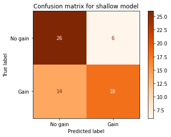

# Predicting Listing Gains
## Problem statement
An investment firm is interested in investing in the Initial Public Offerings (IPO) in the Indian market. This project aims to determine if there will be listing gains for the IPO by building a deep learning classification model. Listing gains are defined as percentage price increase from issue price on listing day.
## Data
Data is taken from moneycontrol and consists of information on Indian IPOs from 2010 to 2022.

Data description:
- Date: date when the IPO was listed
- IPOName: name of the IPO
- Issue_Size: size of the IPO issue, in INR Crores
- Subscription_QIB: number of times the IPO was subscribed by the QIB (Qualified Institutional Buyer) investor category
- Subscription_HNI: number of times the IPO was subscribed by the HNI (High Networth Individual) investor category
- Subscription_RII: number of times the IPO was subscribed by the RII (Retail Individual Investors) investor category
- Subscription_Total: total number of times the IPO was subscribed overall
- Issue_Price: the price in INR at which the IPO was issued
- Listing_Gains_Percent: is the percentage gain in the listing price over the issue price
## Conclusion
Overall, both models showed similar results with accuracy scores over 67%, precision over 75% and recall over 50%. Surprisingly, shallow model showed slightly better results in two out of three metrix used. One of the possible resons for that could be the fact that the sample size is relatively small. Increasing sample size or intrudusing some sort of hyperparameters tuning might result in improvement for the deep model.
In order to fully access the performance of the models, we need to also consider the nature of the problem. As investors, we are more interested in gains, thus the classes in the classification might not have the same weight for us. When looking at recall scores, it can be concluded that around 50% of gains were missed, as half of predictions for IPOs whcih were issued at a profit, were wrongly classified as "No gains". On the other hand, just around 25% of IPOs that had no gains were wrongly classified as "Gains". Shallow model showed a better recall score, while deep model showed a better precision value.

---

This project is part of assignment for Data Scientist in Python course on Dataquest